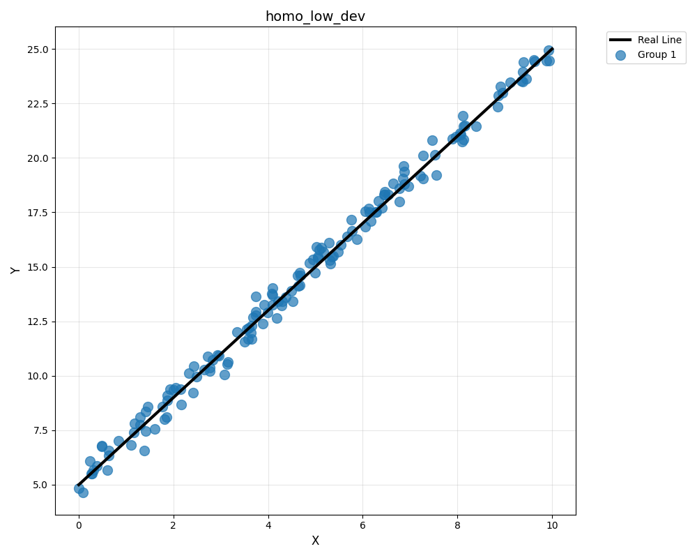
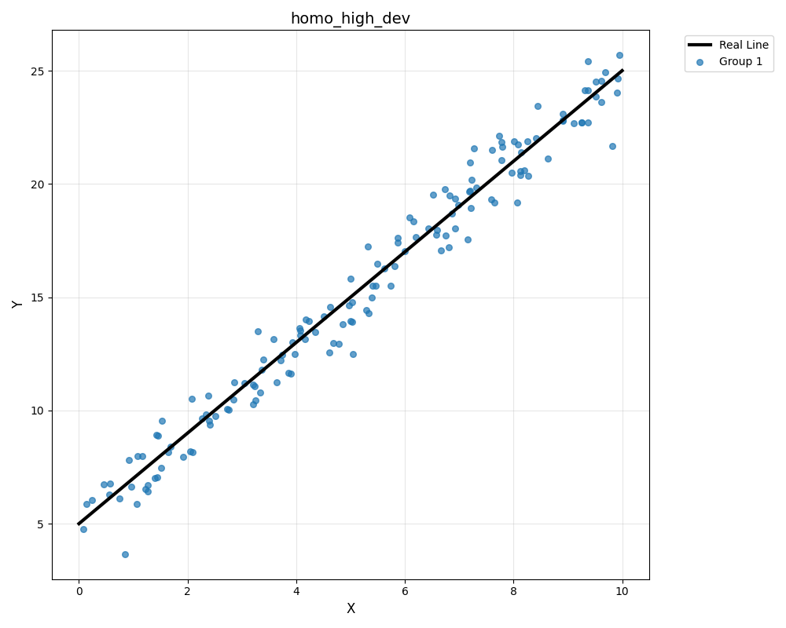
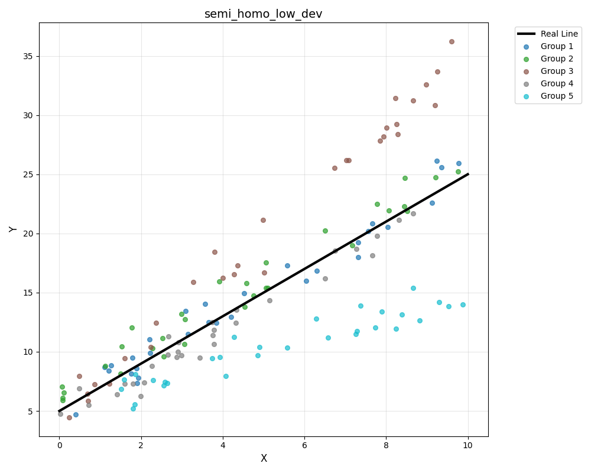
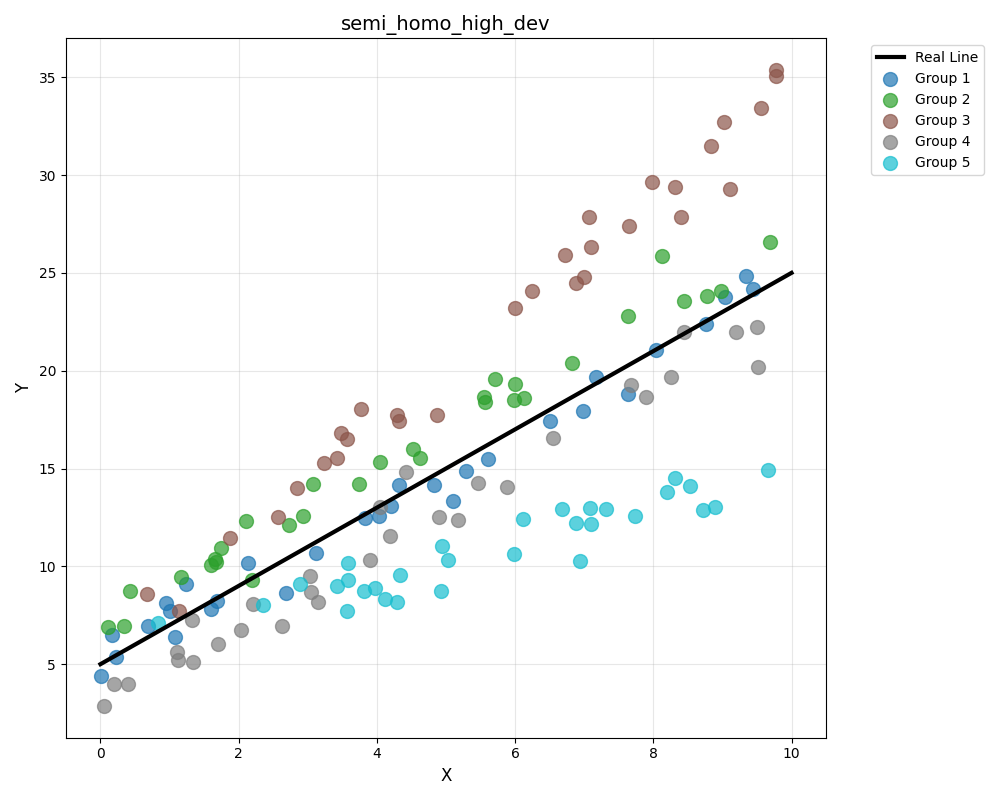
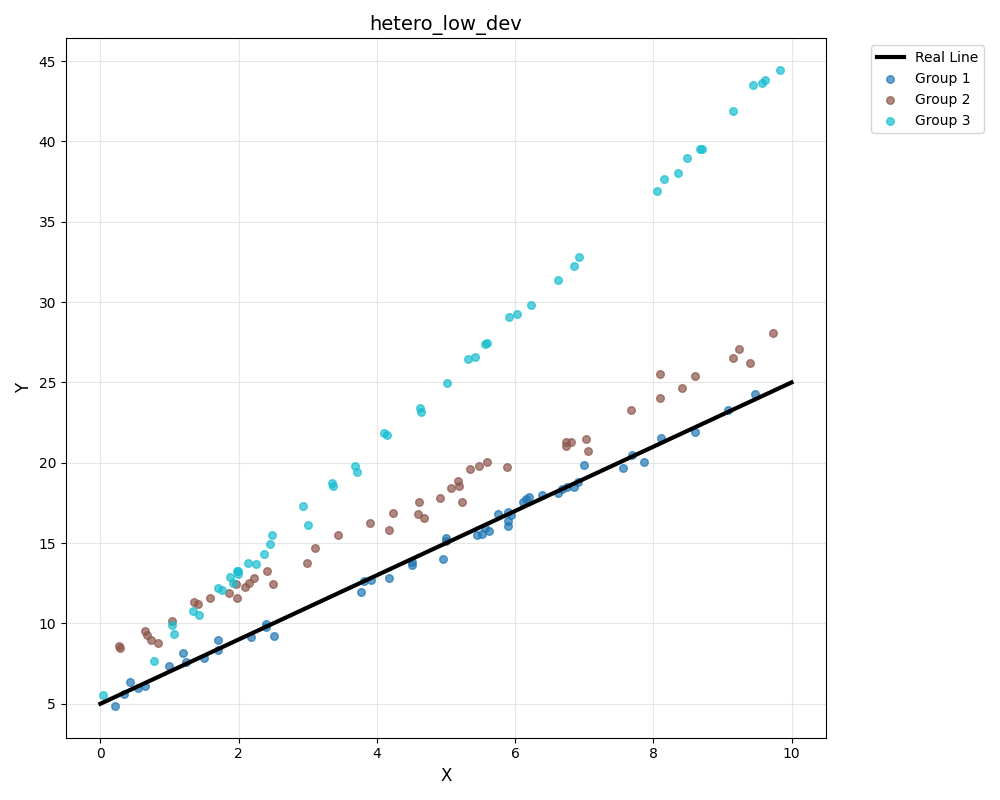
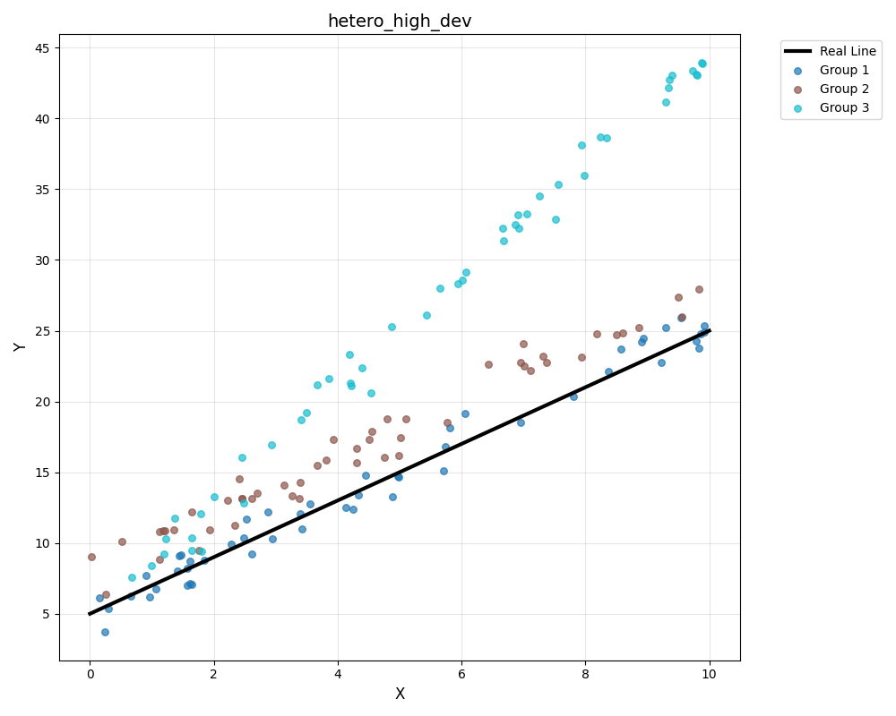

# FLSim

A tool for simulation and analysis of top Federated learning (FL) client selection (CS) algorithms.

## Simulation Logic

This simulation tries to derive a 2D line using federated learning on 15 clients. We assume that we have are trying to reach a "true" line, and create different syntetic datasets for clients, where some follow this "true" line, and some don't. Clients all have different download, compute and upload time, and they differ in many other ways as well. User can adjust these parameters as explained later to run the simulation in different settings. Simulation currently supports the following client selection algorithms:

- **Loss based client selection**: Selects clients with the highest training loss to participate in the next round

- **Threshold based client selection**: Chooses clients who submit their local updates before the deadline

- **Reputation based client selection**: Picks clients based on their historical response times

- **Reputation-update based client selection**: Picks clients whose local updates are close to other clients

- **Multi-criteria based client selection**: Selects clients using a combination of factors such as:
    - Response time
    - Dataset size
    - Sample freshness
    - Loss

- **Random client selection**: Randomly selects clients from the available pool for each round

- **Pick-all client selection**: Includes all available clients in every training round

## Experiments

### Running an Experiment

Before running the experiment, you should go into the config.py file in the root directory, and modify the variables according to your needs. The explanation of the possible values for the `exp_type` variable is given below, since it is not clear from the get go.

To run an experiment, run `managers/run_all_exp.py` from the root directory. This will run all simulations with all possible CS algo + dataset pretune combinations (so 4*6=24 experiments) in parallel, and repeat this multiple times to get averaged results. The results from the experiment will be saved under `plot/outputs/` directory.

### Pretuned Datasets

There are several pretuned experiment datasets for a user to utilize. The datasets are still generated during runtime, but these options effect the parameters of the dataset being generated. Types of datasets, with their explanations, and instructions on how to run an experiment is given below.

- **homo_low_dev**: Syntetic datasets of the clients all follow the same normal distribution, and they all have low individual deviation

- **homo_high_dev**: Syntetic datasets of the clients all follow the same normal distribution, but with deviation high individual deviation

- **semi_homo_low_dev**: Syntetic datasets of clients follow different normal distributions. In particular, some have positively skewed data, and some have negatively skewed data, and some are between. But they all follow low individual deviations, and they average to the true line.

- **semi_homo_high_dev**: Syntetic datasets of clients follow different normal distributions. In particular, some have positively skewed data, and some have negatively skewed data, and some are between. They all follow high individual deviations, but they average to the true line.

- **hetero_low_dev**: Syntetic datasets of clients follow different normal distributions. In particular, some are positively skewed, and some are on the true line. But they follow low individual deviations.

- **hetero_high_dev**: Syntetic datasets of clients follow different normal distributions. In particular, some are positively skewed, and some are on the true line. They follow high individual deviations.

## Adding FL Methods

Add your unique FL method by following the below two steps

1) Add your algorithm as an `ENUM` under `fl_simulator/common.py`, follow the same patter as other algorithms existing the python file to achieve this.

2) 